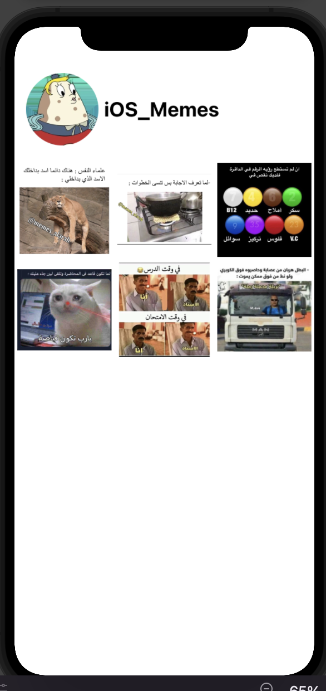

<p dir="rtl">
<strong>تعديل الصور </strong></p>


---

<p dir="rtl">
قواعد الكتابة</p>


<p dir="rtl">
اضافه الصور</p>
 
<p dir="rtl">
طريقة اضافة الصور</p>


```swift
Image("Background")
إسم الصورة 
```

<p dir="rtl">

تعديل الصورة</p>

<p dir="rtl">
طريقة تعديلها</p>


```swift
.resizable()
.scaledToFit()
.frame(width:#, height:#, alignment: .center)
.clipShape(Circle())
```


---

## تمرين


1.قم بانشاء تطبيق جديد باسم Instagram


 
2.قم بإضافة الصور داخل ملف الAssets


 
3.قم بتصميم الشكل التالي 


<div dir="rtl">

</div>
